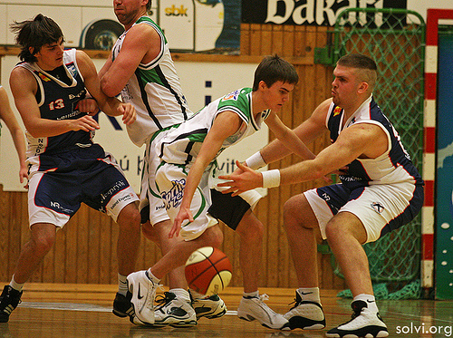
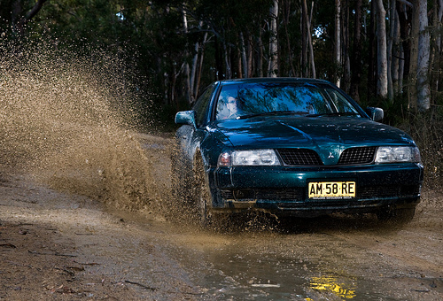
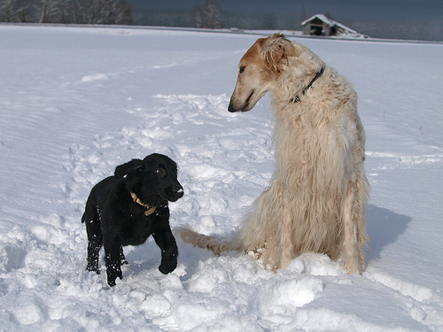
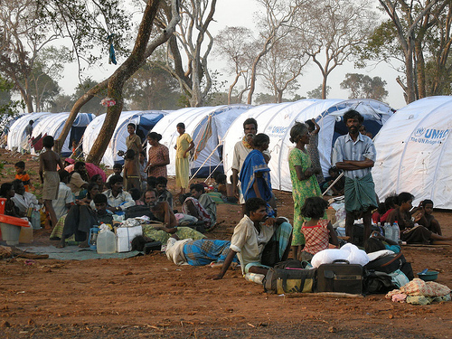
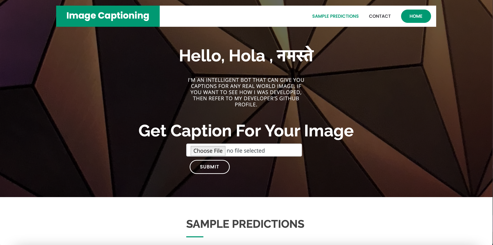
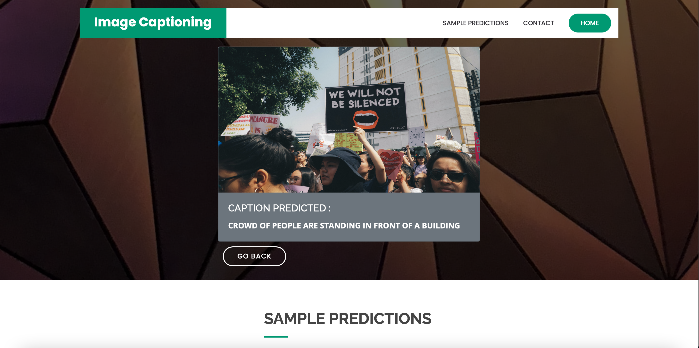
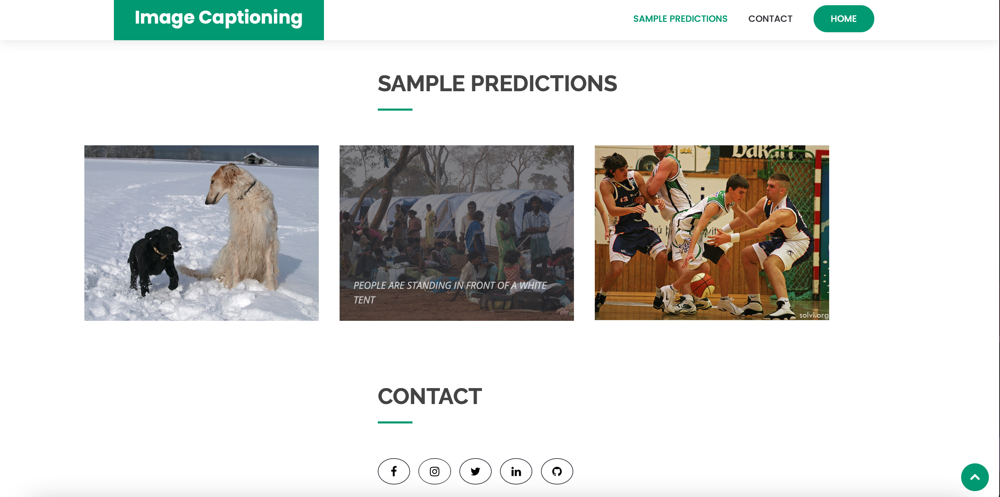

# Image Captioning
Image Captioning is generating a caption for a given image using Deep Learning.

# Dataset 
Dataset used is Flickr8k Dataset available on kaggle. It have 8K images and every image has 5 captions so that makes it a total of 8000*5 = 40,000 captions.

<!--
# Sample Predictions
-->
<!--
<table>
    <tr>
      <td></td>
      <td> </td>
  </tr>
 <tr>
  <td>basketball player dribbles the ball</td> 
  <td>car is driving over a puddle</td> 
</tr>
 <tr>
  <td></td>
  <td></td> 
</tr>
<tr><td>dogs are playing in the snow</td>
  <td>people are standing in front of a white tent</td> 
</tr>
  <table>
-->
    
# Website

# Main Page

# Making Predictions

# Sample Predictions

# Future scope for the project:
This project can be used as a base for more complex projects like 
- Automatic surveillance using CCTV cameras to detect crimes/accidents.
- Aid to the blind people by using a camera to detect scenes in front of them.
- Automatic Captioning can help, make Google Image Search as good as Google Search, as then every image could be first converted into a caption and then search can be performed based on the caption.

# References 
- [https://towardsdatascience.com/image-captioning-with-keras-teaching-computers-to-describe-pictures-c88a46a311b8]
- [https://web.stanford.edu/class/cs124/lec/languagemodeling.pdf]
